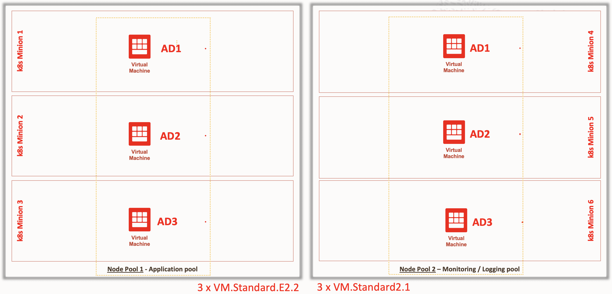
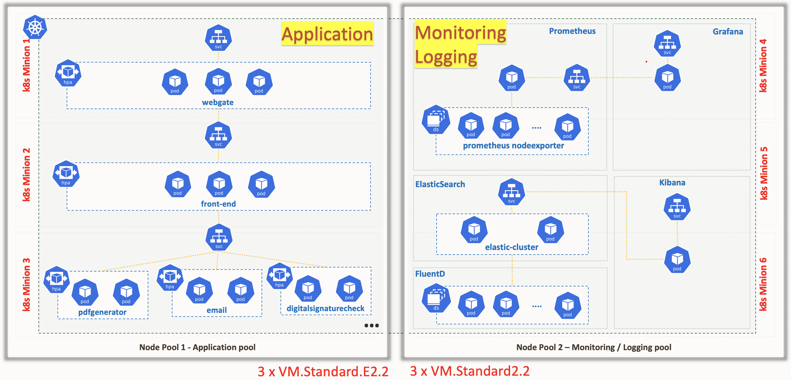
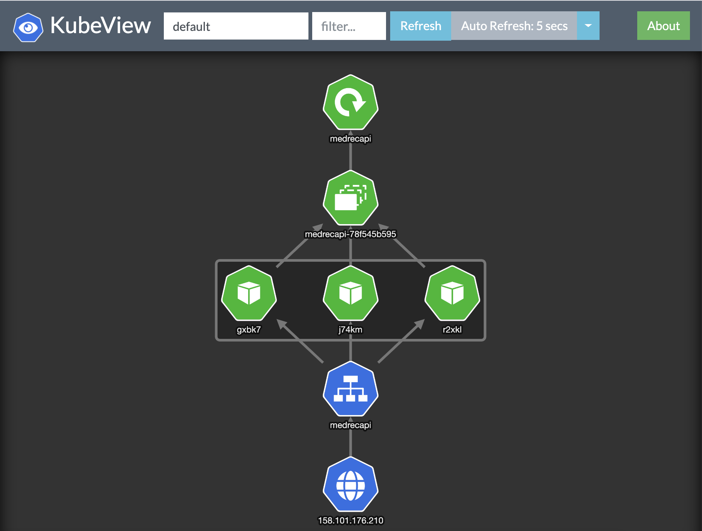
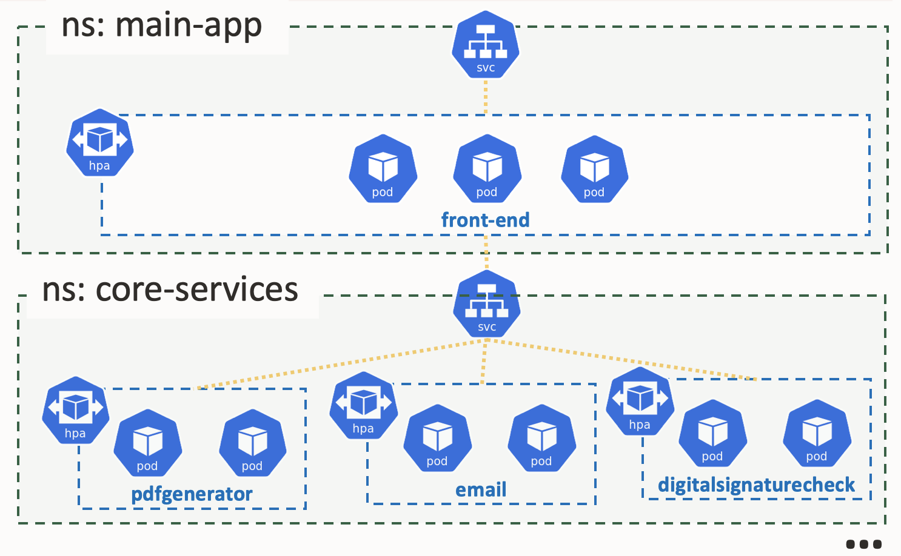
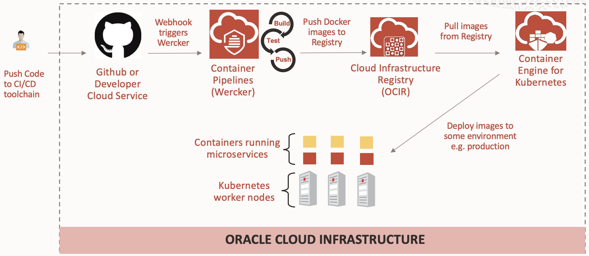

# Applicazioni Cloud Native: Oracle in azione - Demo 2

## Agenda

1. Overview del sistema utilizzato per questa demo
2. CNA tools
3. K8S horizontal scaling
4. CI/CD con Wercker

## 1. Overview del sistema

Questa l'architettura utilizzata durante la Demo 2 del Webinar OKE.



Oltre a queste macchine IaaS che compongono il cluster OKE c'e' una macchina IaaS Oracle Linux con indirizzo pubblico che fa da ponte verso il cluster che chiameremo ***bastion***.

Su questa architettura sono deployati diverse applicazioni e tools.



Si mostra il cluster sul tenant OCI Webinar2.

<br/>

Utilizzando la shell di una macchina Linux *bastion* con accesso pubblico si visualizzano le caratteristiche del sistema:

```bash
kubectl get no
```
```bash
kubectl get no -L node-type
```
Sui nodi `monitoring-node=true` sono installati i tool di logging / alerting / monitoring.

In ogni namespace si trova una applicazione specifica.

```bash
kubectl get namespace
```

<br/>

Ad esempio Grafana / Prometheus sono nel `namespace = monitoring`:
```bash
kubectl get pod -n monitoring
```

## 2. CNA tools

Utilizzeremo i seguenti tools:

### A. Rancher

Rancher e' un tool opensource web di gestione di cluster Kubernetes multi-vendor "at scale". Consente anche l'installazione di CNA tools e plugin sui cluster Kubernetes che amministra.

Suse Linux ha appena annunciato l'intenzione di acquistare Rancher.

Nel nostro caso, per semplicità, Rancher e' installato in single instance come docker container sulla macchine del *bastion* (Rancher può essere installato anche in HA su un cluster Kubernetes).

Per vedere IP reale e docker running:

```bash
curl ipinfo.io
```

```bash
docker container ps
```
<br/>

#### Classic Rancher view


<br/>

#### New Rancher dashboard


<br/>

### B. Grafana / Prometheus

Sono installati sui minions parte del `tools pool`:
```bash
kubectl get pod,services -n monitoring
```


Si possono aggiungere

* Grafana dashboard dal [Marketplace](https://grafana.com/grafana/dashboards)

* Grafana [Plugin](https://grafana.com/grafana/plugins?utm_source=grafana_plugin_list)

<br/>

### C. ElasticSearch / Fluentd / Kibana
Sono installati sui minions k8s del `tools pool`:
```bash
kubectl get deploy,ds,statefulset,pod,services,ingress -n logging-efk
```
```bash
kubectl get deploy,pod,services -n logging-ingress
```


<br/>

### D. KubeView

E' installato sui minions k8s del `tools pool`:
```bash
kubectl get deploy,pod,services -n kubeview
```



<br/>

### E. k9s

E' un tool stand-alone per sviluppatori molto utile installato sulla macchina *bastion*.

Si lancia semplicemente da linea di comando bash.
```bash
~/k9s
```
Poi si usa come se fosse un `vim`.


> Esempio:
>
> :ns
>
> :po
>
> :deploy
>
> :svc

<br/>

## 3. K8S horizontal scaling

### Sample application overview

La seguente figura illustra la Sample application nella quale verra' indotto stress:



Per vedere i componenti deployati nel cluster che sottintendano la Sample application (due namespaces) si possono usare i seguenti comandi:
```bash
kubectl get deployment,pod,hpa,services,endpoints -n main-app -owide
```
```bash
kubectl get deployment,pod,hpa,services,endpoints -n core-services -owide
```

### Monitoring

Per monitorare il sistema durante il carico si può usare il seguente comando (da lanciare su altra shell rispetto a quella in cui si lancia il `siege`):

```bash
watch -n 1 "kubectl top no && echo && kubectl get hpa,po -n core-services"
```
```bash
~/k9s
```

Oppure i seguenti tool:
* KubeView
* Grafana
  * Dashboard Cluster
  * Dashboard Nodes
* Kibana
  * Mostrare le varie "Search"
* Rancher

### Stress del sistema

Si lancia il carico sul sistema con il seguente comando:
```bash
siege -c 10 -r 10000 "http://130.61.206.200/LoadOKE/TestOKEService?servlist=email-service.core-services.svc.cluster.local:8080,pdf-generation-service.core-services.svc.cluster.local:8080,digitalsignchecker-service.core-services.svc.cluster.local:8080&threadnum=5,5,5&elabtime=100,100,100&errperc=10,5,10"
```

Dopo alcuni minuti di carico il sistema raggiunge il regime (massimi valori impostati nel hpa i.e. 10 pod per deployment).

## CI/CD con Wercker

Useremo il seguente processo semplificato come template per implementare un la nostra pipeline CI/CD.



<br/>

Oracle Wercker e' un SaaS che consente agli sviluppatori di sviluppare pipeline di CI/CD per le loro applicazioni e microservizi, quindi automatizza build, test e deploy del software sui vari ambienti. Wercker e' partito come progetto open-source nel 2010 cofinanziato da una venture capital e dal MIT e' stato acquisito da Oracle per integrarlo con i propri prodotti mantenendo comunque l'intenzione di integrazione con gli altri software open-source.

<br/>

Si mostrano i componenti del sistema:

- <u>Developer IDE</u>: tramite il quale gli sviluppatori gestiscono / modificano una applicazione denominata *MedRecAPI* che implementa delle REST API sviluppate in Java
- <u>GIT hub</u> usato per il GIT (in alternativa potevamo usare anche DevCS come GIT)
- <u>Wercker</u> come motore CI/CD (build, test, deploy)
- <u>OCIR</u> come registry per le immagini
- <u>OKE</u> (lo stesso cluster già usato prima)
- La nostra applicazione *MedRecAPI*REST API tramite Swagger UI (Medical Record API):
  - Test delle funzionalità di base di una applicazione REST API con CRUD

<br/>

L'applicazione REST API containerizzata e' deployata sullo stesso cluster OKE nel namespace *default*.

```bash
kubectl get deploy,po,svc -owide
```

<br/>

La logica di fondo e' la seguente:

1. Lo sviluppatore modifica il codice e modifica i test unitari:
   1. incremento dei record utilizzati per fare il test unitario
   2. Cambio del nome dell'applicazione

2. Usando IDE lo sviluppatore fa commit e push del codice su GIT (DevCS)

3. Il GIT server su DevCS viene aggiornato

4. Grazie al webhook di Werker sul GIT viene triggerata una pipeline che alla fine produrrà una nuova immagine
5. La nuova immagine una volta testata viene pushata su OCIR
6. Alla fine Wercker fa il deployment su OKE della nuova Docker image tramite il manifest salvato su GIT

<br/>

Durante il deployment si usano i seguenti strumenti per monitorare il `rolling rollout`(su due shell distinte):
```bash
watch -n 1 kubectl get deployment,po,svc -owide
```
```bash
kubectl get po -w
```

```bash
~/k9s
```

<br/>

Per vedere gli item ritornati dalla API `/admin/all` si può usare:

```bash
curl -s -X GET --header 'Accept: application/json' 'http://158.101.176.210:8080/admin/all'|jq
```
Oppure in un loop (solo la size dell'array):
```bash
while true; do env TZ=Europe/Rome date  ;curl -s -X GET --header 'Accept: application/json' 'http://158.101.176.210:8080/admin/all'|jq length; sleep 2; done
```

<br/>

Dopo il deployment si verifica che l'applicazione sia effettivamente cambiata tramite Swagger UI.


